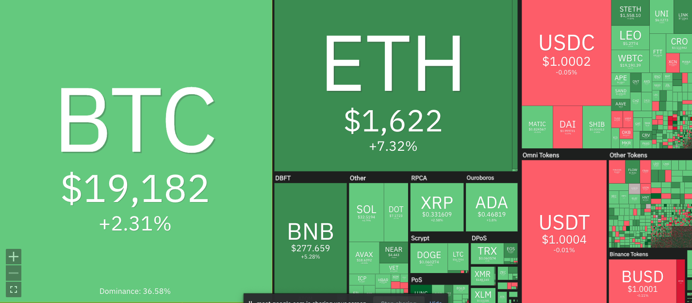

A dashboard where you can see the price of Bitcoin in the main exchanges. These are:
- Binance
- FTX
- KuCoin
- BitStamp
- BitFinex
- Kraken
- Coinbase

Built using Gspread, Python, Telegram, Telebot, and each exchange API.

## How does it work? ❔
First, you have the price for each BTC pair in each exchange, and then this prices are pasted in a google sheet in order to be able to use in a webpage, or a dashboard.

## Authors 👦
- Matias Rodriguez ([@rodriguezmatid](https://twitter.com/rodriguezmatid))

## Contributing ✅
PRs and issues are always welcome. Feel free to submit any issues or ideas you have at the [issues page](https://github.com/rodriguezmatid/crypto-dashboard/issues).